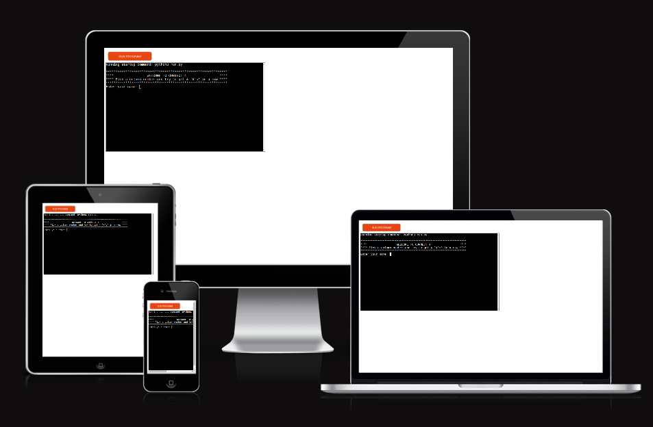
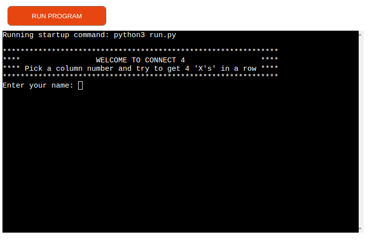
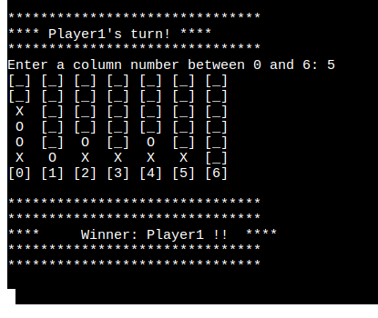
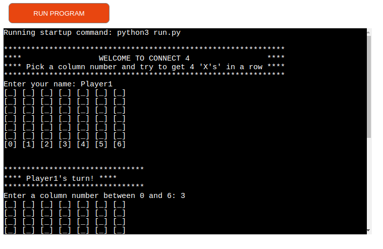
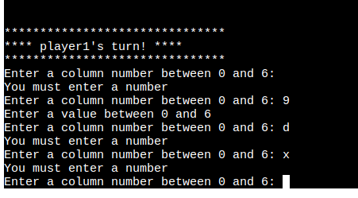
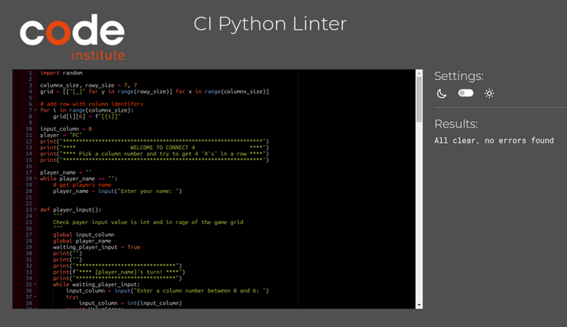
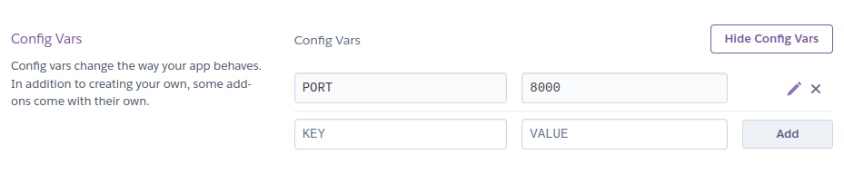
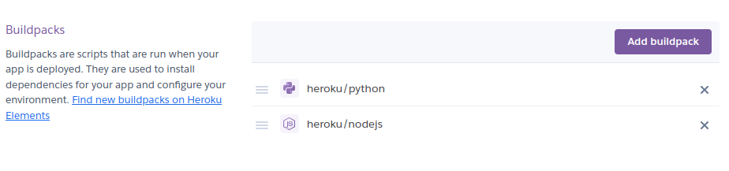
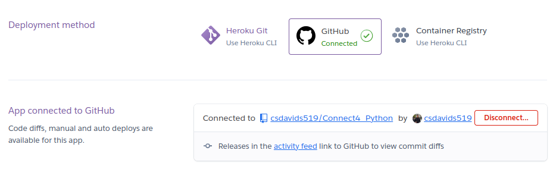
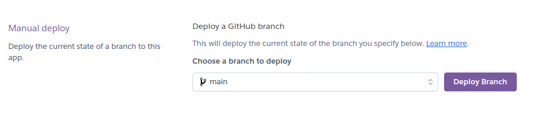

# **Connect 4x**

---

'Connect 4x' is a Python game running deployed with Heroku using the Code Institute terminal template.

Users can play against the computer and try to be the first to connect four of their game tokens in a row.

The live version can be found here: [Connect 4x](https://connect4-2024-a3eeac48a194.herokuapp.com/)

## How to play

Connect 4x is based on a game Connect Four by Milton Bradley in 1974.
The object of the game is to connect four of your tokens in a row while attempting to block your opponent from doing the same.

You can read more about Connect Four here: [Wikipedea](https://en.wikipedia.org/wiki/Connect_Four)

To play Connect 4x the player must pick a column where they would like to input the token.
this token will fall to the lowest free position.
Next is the turn of the PC computer player, who will also place a token in one of the columns.

The winner is the player who can get four of their tokens in a row either horizontally, vertically or on a diagonally.

You can employ some strategic moves and think about how to best block your opponent.

## Features

### Existing Features

- Accepts user player name input

- Continuous checking for winner

- Play against the computer

- Input validations during game play
  - the user may not enter values over the game grid size
  - the user must enter an integer, no letters, or blank entry

### Future Features

- Allow for difficulty level selection, Connect 4 is a 'solved' game this means its possible to have the difficulty increase to the impossible level where the computer player would always win. Currently the game is very easy because the pc player only picks a column at random and has no strategy.
- Allow for multiplayer, the PC player would turn off and allow two people to play each other.
- Allow for token character selection, the player could pick what their token looks like rather than the standard 'X'.
- Currently the code of Connect 4x is not optimized for performance, for example, the list comprehension used to create the game board could be split to for loops to improve performance. Because Connect 4x is only a small program the decision to use list comprehension was made.

## Data Model

Connect 4x uses a double array to keep track of the game play data.
This double array is a grid that gets filled with the players movements.

This double array gets printed to the game board in a format that is clear for the player to understand
where the game tokens are located.

After each player turn, this double array is checked for any possible game win.

## Technologies Used

### Languages

- [Python](https://www.python.org/) - was used to create Connect 4x.

### Frameworks, libraries, and packages

- [Colorama](https://pypi.org/project/colorama/) - was used to produce colored text and background color on the game grid.
- [Simple Term Menu](https://pypi.org/project/simple-term-menu/) - was used to created the game restart or quit menu.

### Tools

- [VSCode](https://code.visualstudio.com/) was used as the code editor.
- [Heroku](https://www.heroku.com/home) - was used to deploy the project.
- [GitHub](https://github.com/) was used to host the code of the website.
- [Am I responsive](https://ui.dev/amiresponsive) was used to generate an image of the site on different screen sizes.
- [CI Python Linter](https://pep8ci.herokuapp.com/) was used to validate the python formatting.
- [Flake8](https://github.com/PyCQA/flake8/tree/main) was used to validate the python formatting.

## Testing

I have manually tested this project with the following tests:

|               Tests               | Passed |                                              Comments                                              |
|:---------------------------------:|:------:|:--------------------------------------------------------------------------------------------------:|
| PEP8 Linters                      |    X   | Passed through both Flake8 and CI Linter without issues                                            |
| Check user inputs validation      |    X   | Input values for user name and column selection respond to invalid data and display error messages |
| Check code runs in local terminal |    X   | Connect 4x runs in the local Python3 terminal with requirements loaded                             |
| Check code runs in Heroku         |    X   | Connect 4x runs as expected when deployed to Heroku                                                |
| Restart is possible               |    X   | Connect 4x restarts with a clean game board after user selects retry option                        |

### Flow Chart

See flow chart of Connect 4x functions:
[FlowChart](documentation/flow_chart.pdf)

### Bugs

#### Solved Bugs

- During the creation of the game board many issues arose such as getting the grid printing in the correct X,Y format.
As well getting the grid to print the columns vertically.
This was solved after learning about 'end=" "' property in the print function.

- During deployment to Heroku the first attempt failed due to items on the requirements.txt file that where not necessary.
After some checking, it was clear the 'pip freeze' command listed all installed python packages, from my PC, none of these where
actually requirements for my project. I installed 'pipx pipreqs' to check the actual requirements for this project.
There are no required packages needed to run Connect 4x that do not come included in Python3.

- After reducing duplicate code in the 'check winner' function, there was an issue where it was not possible to win the game when four tokens where placed in column six. This error ocurred because of the Index Error check, when the first index error was found the code for checking vertical winning was skipped. This issue was solved by adding a 'try' for each win direction check. The Index Error is expected and ignored because as the check gets near the edge of the grid boarders it continues to check passed the grid limits, this error is ignored because it is not possible to win in this scenario and does not affect game play.

#### Open Bugs

- no open bugs remain

### Validator Testing

- PEP8
  - No errors found from Flake8 vscode extension
  - No errors found from pep8ci.com

  

### Deployment

This project was deployed using Code Institutes terminal template for Heroku.

Steps to deploy on Heroku:

1. Create a Heroku account
2. View the settings of the project via the settings tab
3. Check Config Vars add:
    key: Port Value: 8000

4. Check Buildpacks include the following in the correct order:
    1. heroku/python
    2. herku/nodejs

5. On Deploy tab choose Deployment method GitHub and connect your GitHub account.

6. In the manual deploy section select the correct branch and deploy your project.

### Credits

- Code Institute for the deployment terminal template
- [w3schools](https://www.w3schools.com/python/default.asp) for helping to solve my issue when printing the game grid
- [Shaun Halverson](https://youtu.be/i_4ZWjmybWs?si=6AXq3a2puR_vBvCJ) Although the code needed to be modified for this connect 4 project,
    Shaun Halverson is credited for the method of checking for the game winners.
- [Heroku](https://www.heroku.com/home) - for deploying the project on a student account.
- [Colorama](https://pypi.org/project/colorama/) - was used to produce colored text and background color on the game grid.
- [Simple Term Menu](https://pypi.org/project/simple-term-menu/) - was used to created the game restart or quit menu.
