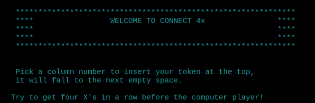
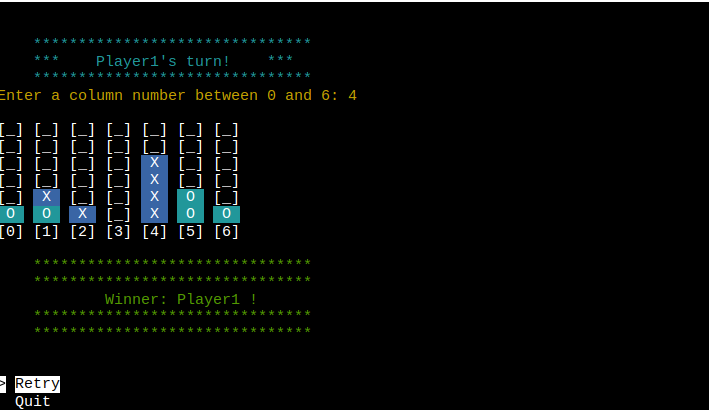
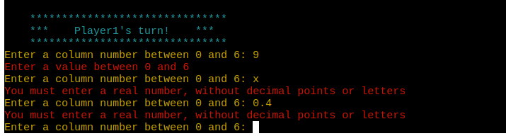

# *Connect 4x*

---

'Connect 4x' is a Python game running deployed with Heroku using the Code Institute terminal template.

Users can play against the computer and try to be the first to connect four of their game tokens in a row.

The live version can be found here: [Connect 4X](https://connect4-2024-a3eeac48a194.herokuapp.com/)

## How to play

Connect 4x is based on a game Connect Four by Milton Bradley in 1974.
The object of the game is to connect four of your tokens in a row while attempting to block your opponent from doing the same.

You can read more about Connect Four here: [Wikipedea](https://en.wikipedia.org/wiki/Connect_Four)

To play Connect 4x the player must pick a column where they would like to input the token.
this token will fall to the lowest free position.
Next is the turn of the PC computer player, who will also place a token in one of the columns.

The winner is the player who can get four of their tokens in a row either horizontally, vertically or on a diagonally.

You can employ some strategic moves and think about how to best block your opponent.

## Features

### Existing Features

- Accepts user player name input

- Continuous checking for winner

- Play against the computer
- Input validations during game play
  - the user may not enter values over the game grid size
  - the user must enter an integer, no letters, or blank entry

### Future Features

- Allow for difficulty level selection, Connect 4 is a 'solved' game this means its
    possible to have the difficulty increase to the impossible level where the computer player would always win.
- Allow for multiplayer, the PC player would turn off and allow two people to play each other.
- Allow for token character selection, the player could pick what their token looks like rather than the standard 'X'.

## Data Model

Connect 4x uses a double array to keep track of the game play data.
This double array is a grid that gets filled with the players movements.

This double array gets printed to the game board in a format that is clear for the player to understand
where the game tokens are located.

After each player turn, this double array is checked for any possible game win.

## Technologies Used

- [Python](https://www.python.org/) - was used to create Connect 4x.
- [VSCode](https://code.visualstudio.com/) was used as the code editor.
- [GitHub](https://github.com/) was used to host the code of the website.
- [Am I responsive](https://ui.dev/amiresponsive) was used to generate an image of the site on different screen sizes.
- [CI Python Linter](https://pep8ci.herokuapp.com/) was used to validate the python formatting.
- [Flake8](https://github.com/PyCQA/flake8/tree/main) was used to validate the python formatting.

## Testing

I have manually tested this project with the following tests:

- Passed the code through a PEP8 linter - no issues found.
- Checked invalid user inputs are managed - the code can manage all expected incorrect input data.
- Checked the code is working in both local terminal and Heroku terminal.
- Checked the latest branch is pushed and deployed live on Heroku.

### Bugs

#### Solved Bugs

- During the creation of the game board many issues arose such as getting the grid printing in the correct X,Y format.
    As well getting the grid to print the columns vertically.
    This was solved after learning about 'end=" "' property in the print function.

- During deployment to Heroku the first attempt failed due to items on the requirements.txt file that where not necessary.
    After some checking, it was clear the 'pip freeze' command listed all installed python packages, from my PC, none of these where
    actually requirements for my project. I installed 'pipx pipreqs' to check the actual requirements for this project.
    There are no required packages needed to run Connect 4x that do not come included in Python3.

#### Open Bugs

- no open bugs remain

### Validator Testing

- PEP8
  - No errors found from Flake8 vscode extension
  - No errors found from pep8ci.herokuapp.com

  

### Deployment

This project was deployed using Code Institutes terminal template for Heroku.

Steps to deploy:
    - Fork or clone this repository
    - Create a new Heroku app
    - Select the correct buildpacks python and node.js in this order
    - Link the Heroku app to the repository
    - Click Deploy

### Credits

- Code Institute for the deployment terminal template
- [w3schools](https://www.w3schools.com/python/default.asp) for helping to solve my issue when printing the game grid
- [Shaun Halverson](https://youtu.be/i_4ZWjmybWs?si=6AXq3a2puR_vBvCJ) Although the code needed to be modified for this connect 4 project,
    Shaun Halverson is credited for the method of checking for the game winners.
